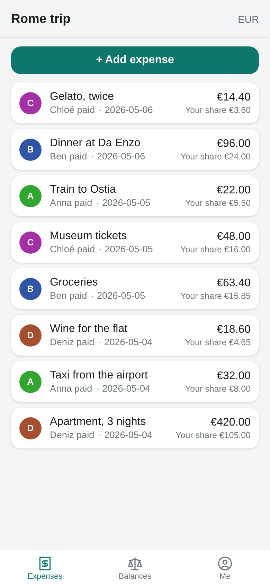
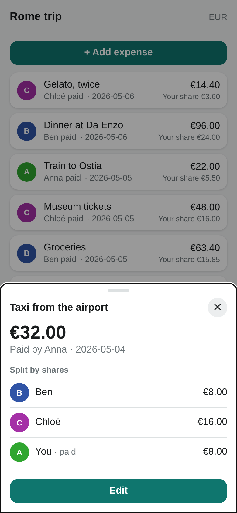
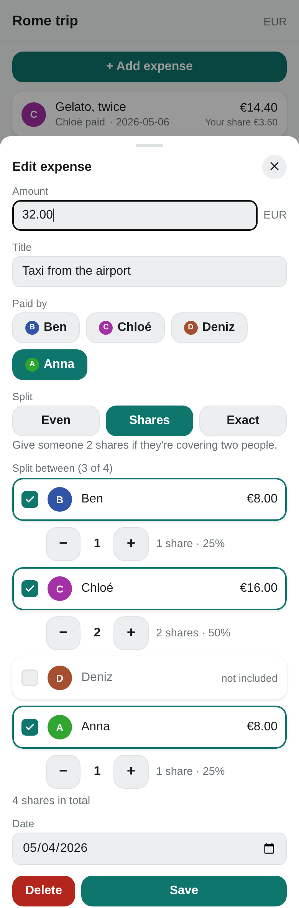
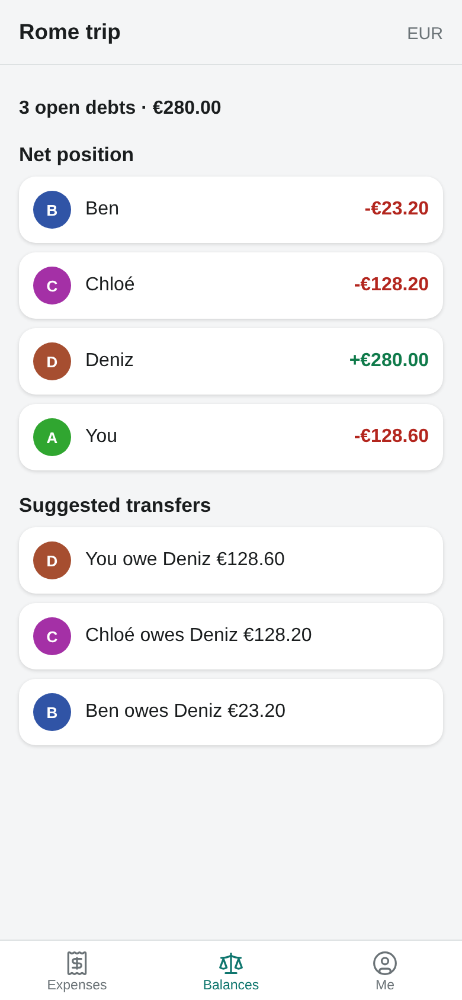
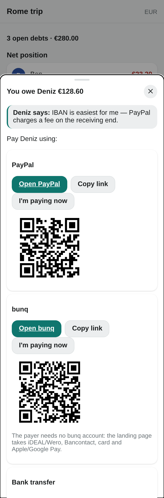
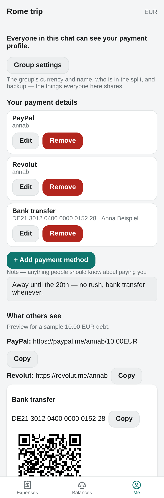

# Halvsies

A bill-splitting **webxdc** mini-app for Delta Chat (and other webxdc messengers) with first-class **pay-up helpers**: every debt becomes a few-click payment via generated deep links, EPC QR codes, and send-to-chat flows.

See [webxdc.org](https://webxdc.org/) for more about the webxdc platform.

## What makes it different

Members attach payment coordinates (PayPal.Me, IBAN, Revolut, Wise, Venmo, Monzo, or a custom URL template), and Halvsies generates amount-pre-filled payment links and EPC QR codes so settling a debt takes seconds. No accounts, no server, end-to-end encrypted via the chat.

> Status: early development. See [`./Plan.md`](./Plan.md) for the design and roadmap.

## Screenshots

<table>
  <tr>
    <td width="33%"></td>
    <td width="33%"></td>
    <td width="33%"></td>
  </tr>
  <tr>
    <td>Grouped by day, newest first — with your share on each.</td>
    <td>Tapping an expense opens a read-only summary. Editing is a deliberate second tap.</td>
    <td>Split evenly, by shares, or by exact amounts.</td>
  </tr>
  <tr>
    <td></td>
    <td></td>
    <td></td>
  </tr>
  <tr>
    <td>Who owes whom, in as few transfers as possible.</td>
    <td>One tap from a debt to actually paying it — link, copy, QR, or straight into the chat.</td>
    <td>Your payment details, previewed exactly as the payer will see them.</td>
  </tr>
</table>

Regenerate them with `node scripts/screenshots.mjs` — it drives the real app in
headless Chrome against a fixed demo ledger, so the output is reproducible.

## Development

### Install

```sh
pnpm install
```

### Run

Runs the Vite dev server:

```sh
pnpm dev
```

### Multi-peer testing

Starts the dev server and the webxdc dev simulator together, for testing several peers against each other:

```sh
pnpm test:peers
```

### Check / lint

```sh
pnpm check        # typecheck + prettier
pnpm fix          # auto-fix formatting
```

### Test

```sh
pnpm test
```

### Build

Produces `dist-xdc/halvsies.xdc`:

```sh
pnpm build
```

Send the `.xdc` into a chat in any webxdc-capable messenger (e.g. Delta Chat).

## Release

Push a `vX.Y.Z` tag; the GitHub Action in `.github/workflows/release.yml` builds the `.xdc` and attaches it to a GitHub Release:

```sh
git tag v0.1.0
git push origin v0.1.0
```

Every push and pull request also runs CI (`.github/workflows/ci.yml`): typecheck, lint and build. PRs automatically get a downloadable preview build linked in the PR comments.

## App store

Submissions go through [webxdc/xdcget](https://codeberg.org/webxdc/xdcget), the config that feeds the `xstore` bot and the default app stores: fork it, add a section to `xdcget.ini`, and open a pull request ([SUBMIT.md](https://codeberg.org/webxdc/xdcget/src/branch/main/SUBMIT.md) has the rules). This is a manual step — it is not automated.

The entry for this app:

```ini
[app:halvsies]
category = tool
source_code_url = https://github.com/experintellia/Halvsies
description = Split bills, then actually pay
    Track shared expenses in a chat, see who owes whom, and settle with
    generated payment links, IBAN details and QR codes.
```

What the submission requires, and where this repo already stands:

- **Public repo on Codeberg or GitHub** — currently private; make it public first.
- **A tagged release with an `.xdc` asset** — `.github/workflows/release.yml` does this on every `v*.*.*` tag.
- **`manifest.toml` and an icon inside the `.xdc`** — `public/manifest.toml` and `public/icon.png`, both verified in the release artifact.
- **App id lowercase alphanumeric with `-`** — `halvsies`.
- **Description first line ≤ 30 characters, no trailing period** — the line above is 30.

## Privacy

A member's payment profile (payment coordinates, account name, etc.) is visible to everyone in that chat.

## License

MIT
